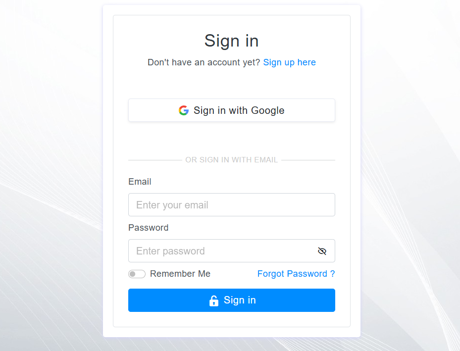
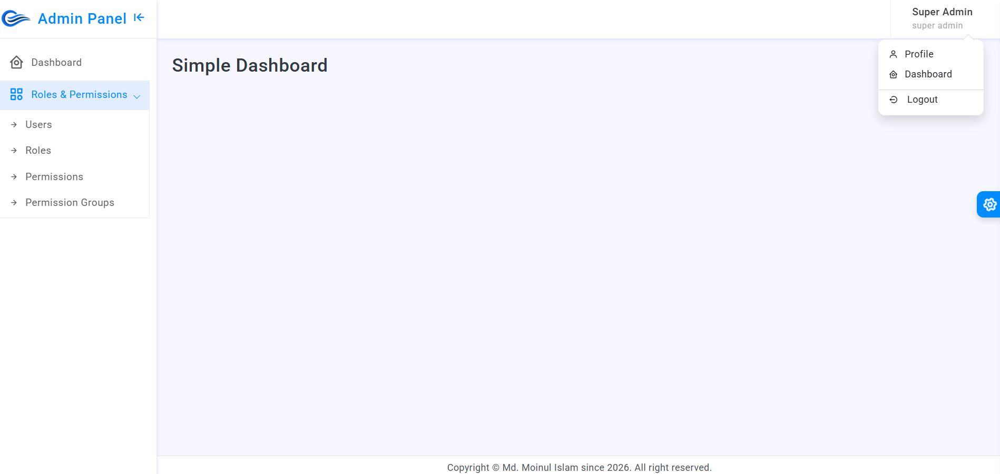
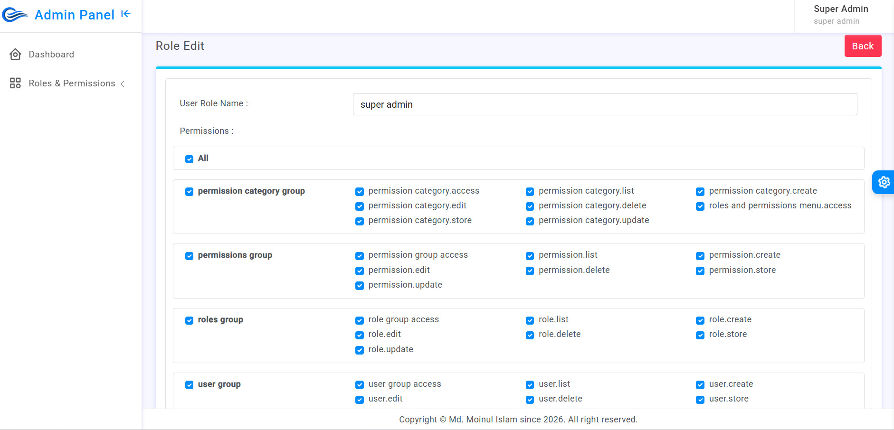

🚀 <b>Breeze + Spatie RBAC Starter Project</b>

A Laravel starter project demonstrating authentication, authorization, social login, and role-based access control (RBAC) using Laravel Breeze and Spatie Laravel Permission. 

<hr/>


🛠 <b>Tech Stack</b>

- Laravel (Latest stable)

- Laravel Breeze (Authentication scaffolding)

- Spatie Laravel Permission (RBAC)

- Google OAuth (Social login)

- Mailtrap SMTP (Email testing)

- Blade + Tailwind CSS

- MySQL  

<hr/>

✨ <b>Features</b>  

🔐 Authentication (Laravel Breeze)

- Login

- Register

- Forgot Password

- Reset Password

- Email Verification

- Resend Verification Email

- Profile Management

- Fully customized Breeze UI theme

- 📧 Email Configuration

- SMTP email support (Mailtrap)

- Email verification

- Password reset emails

🔑 Social Login

- Login with Google

- Auto user creation

- Secure OAuth flow

- 🛡 Authorization (RBAC)

- Role-based access control using Spatie

- Permission grouping

- Middleware-protected routes

- Admin & User separation

🧑‍💼 Admin Panel

- Custom Admin dashboard theme

- User Management (CRUD)

- Role Management (CRUD)

- Permission Management (CRUD)

- Permission Group Management (CRUD)  

<hr/>  

⚙️ <b>Project configuration</b>  

- Install Dependencies  

        npm install  

- .env   
    
        (To change in your env file with following)


        APP_NAME=breeze_spatie

        DB_CONNECTION=mysql  
        DB_DATABASE=breeze_spatie  
        DB_USERNAME=root  
        DB_PASSWORD=  

        SESSION_DRIVER=file  

        MAIL_MAILER=smtp
        MAIL_HOST=sandbox.smtp.mailtrap.io
        MAIL_PORT=2525
        MAIL_USERNAME=your mailtrip username
        MAIL_PASSWORD=your mailtrip password
        MAIL_ENCRYPTION=tls
        MAIL_FROM_ADDRESS="your mail or organization mail"
        MAIL_FROM_NAME="${APP_NAME}"

        GOOGLE_CLIENT_ID = your google client id  
        GOOGLE_CLIENT_SECRET = your google client secret  
        GOOGLE_CLIENT_REDIRECT = "${APP_URL}/auth/google/callback"  


- Import Database  (MySql)

<hr/>

Super Admin : superadmin@gmail.com  
Admin : admin@gmail.com  
Staff : staff@gmail.com  
Employee : employee@gmail.com  

Password : 12345678

```
Note: You can create multiple roles and give access to permission roles wise.
```

<h4>Demo: </h4>  






